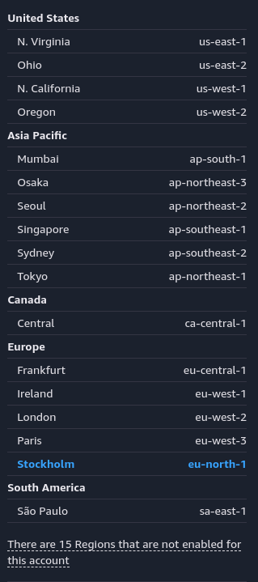

# EC2 (Elastic Compute Cloud)


EC2 is essentially a virtual server managed by AWS, similar to a VPS (Virtual Private Server) you can rent from traditional hosting companies. AWS offers 5 main categories of EC2 instances:

1. General Purpose
2. Memory Optimized
3. Storage Optimized
4. Compute Optimized
5. Accelerated Computing

Each instance type is designed for specific workloads. General Purpose instances *(like t3.medium or m5.large)* provide a balance of compute, memory, and networking resources - ideal for web servers, development environments, and small databases.

Memory Optimized instances *(such as r5.large)* are perfect for workloads that require processing large datasets in memory, including high-performance databases and real-time big data analytics.

Storage Optimized instances *(like d2.xlarge or i3.large)* are designed for workloads requiring high I/O operations and large local storage capacity, such as data warehousing and log processing applications. 

Compute Optimized instances *(c5.large, for example)* deliver superior processing power for compute-bound applications, making them suitable for batch processing, scientific modeling, and dedicated gaming servers.

The Accelerated Computing category is particularly interesting as these instances *(such as p3 or g4 types)* feature GPUs or other hardware accelerators, making them ideal for machine learning, deep learning, high-performance computing, and graphics-intensive applications.

### Launching EC2 Instances

When launching an EC2 instance, AWS asks you to select several options such as:
* Operating System
* Type of the Instance
* Key Pair *(SSH Key Pair to login to the server, by default password login is disabled on EC2 instances)*
* Network Settings (will be mentioned in the VPC section)
* Additional Resources
* and lastly some advanced settings

For free tier eligible instance types, AWS allows you to use up to 750 hours per month for 12 months. This is enough to run one instance 24/7, or multiple instances whose usage totals 750 hours.

## Regions & Availability Zones

AWS can be thought of as an organization that has inter-connected data centers all over the world. When you use the EC2 service, you're essentially renting a virtual server within this huge network. Regions are basically the geographical locations where you want to place your EC2 instances. They look like this:



Availability Zones are distinct locations within regions that determine where your EC2 will be placed. They're called Availability Zones because you can deploy your instance across multiple zones, and if there's a problem in one zone, your duplicated services won't experience any availability issues. So your services will be isolated from failures in other Availability Zones.

This is the naming convention for regions:
```
us-east-1
us-east-2
us-west-1
eu-central-1
eu-west-1
...
```

And this is the naming convention for Availability Zones:
```
us-east-1a
us-east-1b
eu-central-1a
eu-central-1b
eu-central-1c
...
```

### Elastic

As you can see, there is an "Elastic" prefix in the name of the service. Not only in this service, but in many AWS services you can see this prefix. It means that the service is able to scale up and down, providing auto-scaling capabilities.

### Tips

* After you get the private SSH key, store it somewhere safe and be sure that the permission of the file is strict enough.
* Don't forget to update & upgrade packages after the first time you log into the EC2 instance