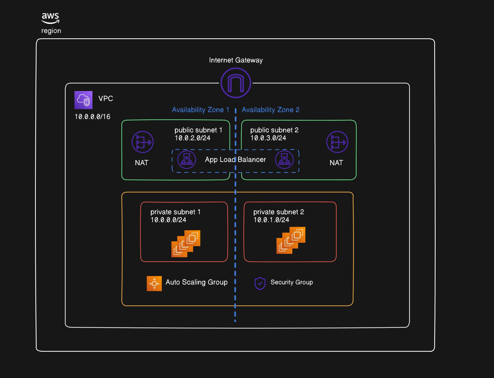

# Project 1

The goal of this project is to apply all of the following topics that have been learned so far:

1. EC2 
2. VPC
3. Load Balancer
4. Security Groups & Network ACLs
5. Regions & Availability Zones
6. Private & Public Subnets
