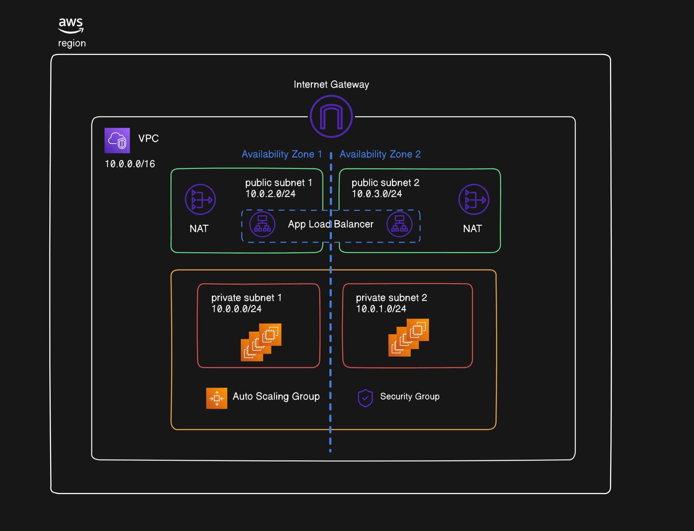

# Project 1



The goal of this project is to apply all of the following topics that have been learned so far:

1. EC2
2. VPC
3. Security Groups & Network ACLs
4. Regions & Availability Zones
5. Private & Public Subnets

Here are the new topics that'll be covered in the project:

1. Auto Scaling Group
2. Load Balancer
3. Target Group
4. Bastion Host or Jump Server _(EC2 instance in public subnet to SSH into EC2 instances in private subnet)_

## Project Guide

Follow along with the [video guide](https://www.youtube.com/watch?v=vRvcf9Wl4ic) which covers these steps:

### 1. Create VPC

- Create 2 private subnets
- Create 2 public subnets
- Set up NAT Gateway in each Availability Zone
- No S3 Gateway endpoint needed

### 2. Configure Auto Scaling Group

- Create launch template
    - Set up security groups for:
        - SSH access
        - Web application traffic
    - Select the VPC created in step 1
- Choose the 2 private subnets from the VPC
- Skip load balancer setup (will configure later)
- Set capacity:
    - Desired: 2 instances
    - Minimum: 1 instance
    - Maximum: 4 instances

### 3. Set up Bastion Host

- Launch EC2 instance
    - Select the created VPC
    - Configure security group for SSH
    - Enable auto-assign public IP
- Transfer private key to bastion host
- Set up Python test server on private instances:
    ```bash
    python3 -m http.server 1337
    ```

### 4. Configure Load Balancer

- Select the VPC created in step 1
- Choose both Availability Zones and public subnets
- Create target group:
    - Configure correct application port
    - Select EC2 instances from Auto Scaling Group
