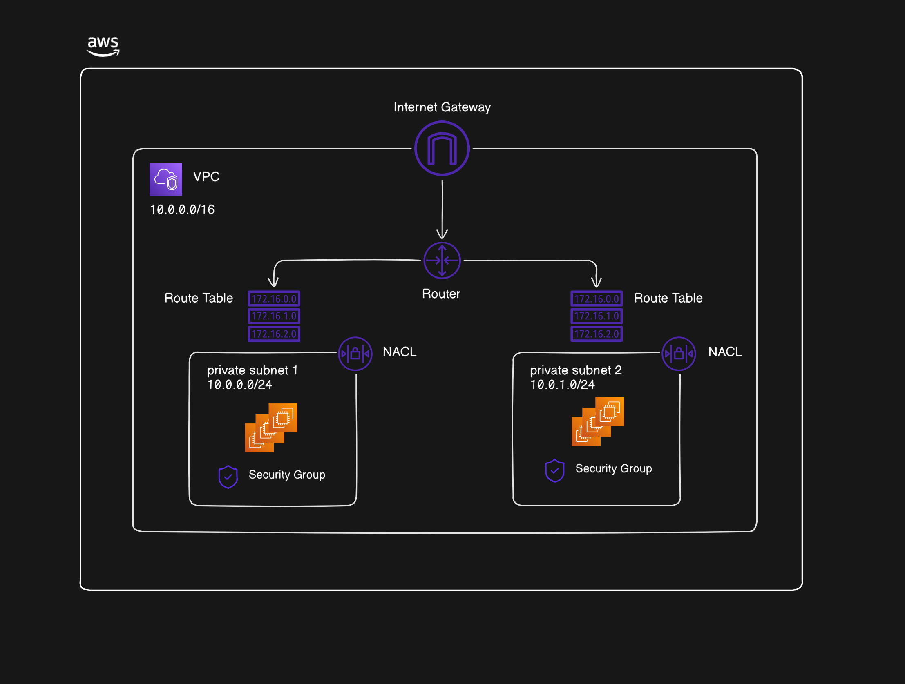

# VPC (Virtual Private Cloud)

Most organizations need a private network to host services that shouldn't be deployed to the public web like databases, sensitive log files, message brokers, cache servers, etc. To address this need, organizations create private networks and assign private IP addresses to these servers. However, this approach doesn't completely solve the problem because some applications need to be accessed through the public web while simultaneously requiring access to servers in the private network. In AWS, this networking architecture is handled by the VPC (Virtual Private Cloud).

A VPC establishes a private network that allows you to restrict access from the public internet to your servers. Within a VPC, you can create both public and private subnets. Servers in the private subnet don't have direct access to the internet, while those in the public subnet do. Resources in the public subnet can also access servers in the private subnet as they're part of the same VPC. Typically, services like message brokers, databases, caches, and third-party services reside in private subnets, while load balancers and routers are placed in public subnets.

Each VPC can have an Internet Gateway which serves as the entry point from the public web. Most inbound requests to the VPC arrive through this gateway. DevOps engineers often position a load balancer immediately after the Internet Gateway to route traffic to the appropriate servers. For private subnet resources to access the internet, a NAT Gateway in a public subnet is commonly used.

In the VPC, traffic is routed with the help of route tables. These route tables consist of a set of rules that determine where network traffic is directed within the VPC or to external destinations. Each subnet in a VPC must be associated with a route table, which controls the routing for that subnet. A VPC can contain multiple public and private subnets, each potentially having different routing configurations to meet specific security and access requirements.

NAT Gateways (Network Address Translation) play a crucial role in AWS VPC design by enabling resources in private subnets to initiate outbound connections to the internet while remaining inaccessible from the public internet. These managed AWS services provide a secure, highly available way for private resources to download updates, access external APIs, or connect to other AWS services without compromising the network's security posture. NAT Gateways are typically deployed in public subnets with routes from private subnets directing internet-bound traffic through them.

Here's a diagram of the VPC in AWS:

### Security

Let's also talk about the Security Groups and the Network ACLs (Access Control List). They can be considered as the inbound and outbound firewall rules. Security Groups provide instance-level security whereas Network ACLs provide subnet-level security. If a request is dropped by the Network ACL, the instance can't receive the request even though Security Groups might accept the traffic.

Regarding configuration, Network ACLs are evaluated based on rule numbers. Rules with lower numbers have higher priority. They operate like if-else statements - once a rule matches traffic, the evaluation stops and that rule's action is applied, ignoring all subsequent rules. Security Groups, on the other hand, work differently. They evaluate all rules collectively, and if any rule allows the traffic, it passes through. Security Groups are stateful (return traffic is automatically allowed), while Network ACLs are stateless (requiring separate inbound and outbound rules), making Security Groups generally more straightforward to configure compared to NACLs.
