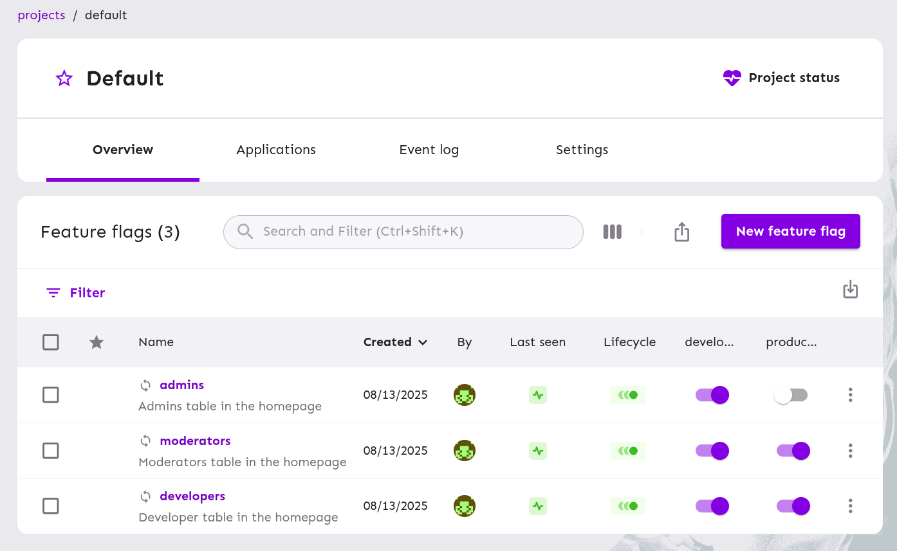

# Unleash Feature Flag Demo

This repository demonstrates how to implement feature flags using **Unleash** combined with trunk-based development. Feature flags decouple deployment from release, reduce risk, and enable continuous delivery. By using trunk-based development instead of complex Git flows (GitFlow, GitHub Flow), you maintain a linear history, minimize long-lived branches, and avoid merge conflicts—every commit goes directly to `main` with feature guards around unfinished work.

## Demo

## Tech Stack

- Backend: NestJS
- Frontend: React
- Feature Flag Service: Unleash

## Setup & Configuration

For a complete walkthrough—Unleash integration, environment configuration, and GitHub Actions CI/CD—please visit the dedicated repositories:

- [Backend & CI (Unleash setup + GitHub Actions)](https://github.com/BooRuleDie/FF-Backend)
- [Frontend Repo & CI (GitHub Actions)](http://github.com/BooRuleDie/FF-Frontend)

## Upsides

1. Continuous Integration: Fewer merge conflicts and integration problems.
2. Git History: Linear, simpler, and cleaner history (PR + squash & rebase).
3. Deployment: Toggle features on/off instantly—no redeploy needed.
4. A/B Testing: Expose features to specific user segments.
5. Team Productivity: Eliminate long-lived branch conflicts; enable parallel work.

## Downsides

1. Flag Management: Remember to clean up flags once features stabilize.
2. Complex Codebase: Conditional logic can add clutter.
3. Infrastructure Requirements: High reliance on unit & integration tests since every commit updates all environments.

