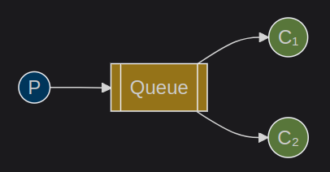
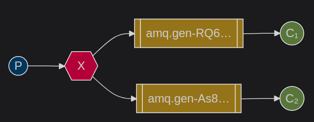
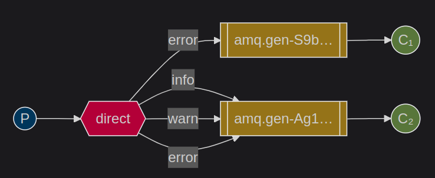

# Usage
To interact with the system, use the following commands for publishing and consuming messages:
```bash
make publish
make consume

make publish-direct info|warning|error "some logs here"
make consume-direct info|warning|error|foo|bar...
```

# Hello World


As shown in the illustration, this represents a basic implementation with a single publisher, consumer, and queue. As the name suggests, this is a "Hello World" application for the RabbitMQ message broker that demonstrates how to set up a queue, publish messages, and consume messages from the queue. To examine the implementation details, please review the contents of the `workerqueues` directory.

# Worker Queues


The same template is used as the "Hello World" example, but some configurations are changed. For instance, messages are durable in this example. In order to make a message durable in RabbitMQ, you need to set the durable flag to true in queue definition and also set the delivery mode as Persistent when publishing messages.
```go
// consumer.go
q, err := ch.QueueDeclare(
	"tasks", // name
	true,    // DURABLE <--
	false,   // delete when unused
	false,   // exclusive
	false,   // no-wait
	nil,     // arguments
)
```

```go
// publisher.go
err = ch.PublishWithContext(
	ctx,
	"",     // exchange
	q.Name, // routing key
	false,  // mandatory
	false,  // immediate
	amqp.Publishing{
		DeliveryMode: amqp.Persistent, // <--
		ContentType: "text/plain",
		Body:        []byte(body),
	},
)
```

It's important to mention that RabbitMQ doesn't use `fsync` like relational databases when you commit the transaction, which means there is a chance that the message is written to the cache instead of the disk. If the system crashes, you might still lose data, but adjusting this configuration significantly increases your system's reliability.

Also, auto-acknowledgment is disabled so that if a consumer fails to consume a task, it can be re-queued for another consumer.

```go
// consumer.go
msgs, err := ch.Consume(
	q.Name, // queue
	"",     // consumer
	false,  // AUTO-ACK <--
	false,  // exclusive
	false,  // no-local
	false,  // no-wait
	nil,    // args
)
```

And lastly, a QoS (Quality of Service) configuration is added for fair dispatch.
```go
ch.Qos(
	1,     // prefetchCount
	0,     // prefetchSize
	false, // global
)
```

The configuration basically states that the maximum amount of unacknowledged messages you can send to a consumer is 1, which means RabbitMQ can't send more than one message unless the previous message it sent to the consumer is acknowledged. `prefetchSize` does the same thing but instead of counting the number of messages sent, it looks at the size of the messages. When you give 0, RabbitMQ ignores this value. And if there is more than one consumer per channel, the global parameter sets the configuration for all of them. In our example, there is just one consumer, so it's set to false.

# Publish / Subscribe


So far we've bound queues with consumers and publishers directly; however, this is not the case in most applications. Most of the time, the producer doesn't know which consumers are going to consume the message that's sent to the broker. It just sends messages to an Exchange and it's the Exchange's job to know how to route the messages to the right queues. If you inspect the `publisher.go` file, you can see that there is no queue declaration but only an Exchange declaration, and when publishing the messages, we've removed the old routing key which was a queue name and instead put an Exchange name there.

There are multiple Exchange types like direct, topic, fanout... The fanout type is used here, which sends the same message to all bound queues.

There are also some changes in the `consumer.go` file. In the queue definition, there is no name for the queue; this tells RabbitMQ to generate one for us. Also, the exclusive flag is set to true. Exclusive makes a queue private, which means only the current connection can access the queue, only one consumer can access the queue, and when the connection is closed, the queue will be removed *(even though there are messages inside)*. So it can be considered as a temporary private queue for the consumer.

We've also declared the Exchange here, and after both Exchange and queue are declared, we bind them together so the Exchange knows which queues to send messages to. Auto-acknowledgment is enabled in this example.

# Routing


In this example, we explore the direct exchange type and sophisticated routing concepts. While the structure closely resembles the previous example, we've introduced a critical difference: when publishing messages, we explicitly specify a `routingKey` that corresponds to message severity (error, warning, info). On the consumer side, before listening on queues, we bind each consumer with one or more particular `routingKeys`. This binding instructs the exchange precisely which queue should receive each message based on its routing key. This selective message distribution allows consumers to process only the message types they're configured to handle, creating a more targeted and efficient messaging system.
```go
// publisher.go
err = ch.PublishWithContext(
		ctx,
		exchangeName, // exchange
		severity,     // routing key
		false,        // mandatory
		false,        // immediate
		amqp.Publishing{
			DeliveryMode: amqp.Persistent,
			ContentType:  "text/plain",
			Body:         []byte(logMessage),
		},
	)
```

```go
// consumer.go
sevs := getSeverities()
	for _, sev := range sevs {
		err = ch.QueueBind(
			q.Name,       // queue name
			sev,          // routing key
			exchangeName, // exchange
			false,
			nil,
		)
		failOnError(err, "Failed to bind a queue")
	}
```

```bash
# start consumers
make consume-direct error                   # consumer 1 only listens for errors
make consume-direct info warning # consumer 2 listens for both warnings and info logs

# publish
make publish-direct info "some info log"
make publish-direct error "some error log"
make publish-direct warning "some warning log"
```