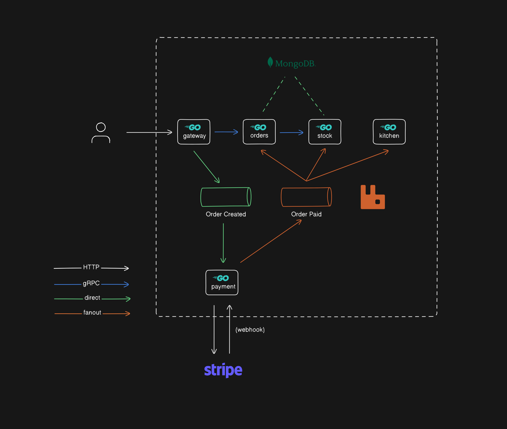
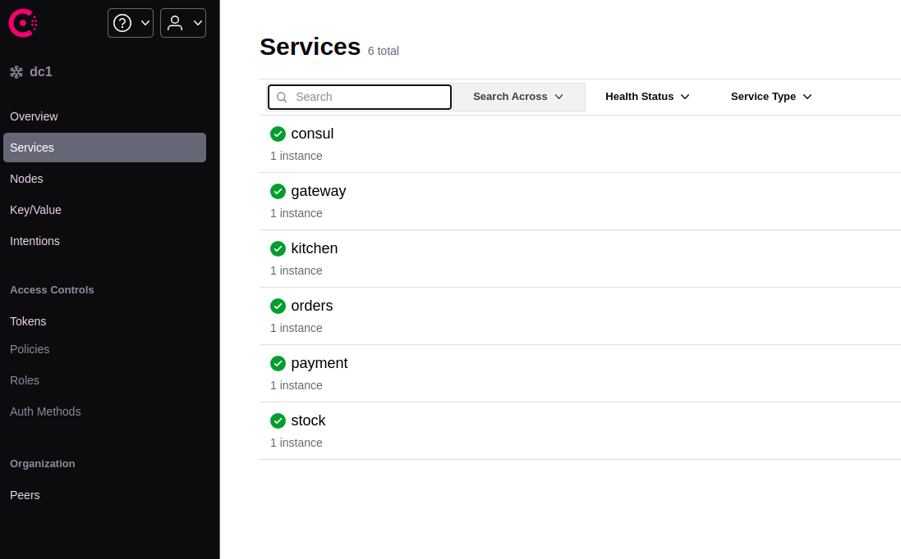
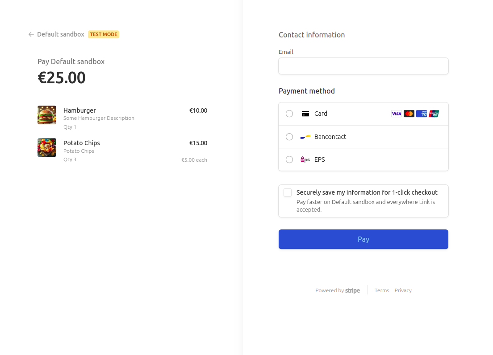
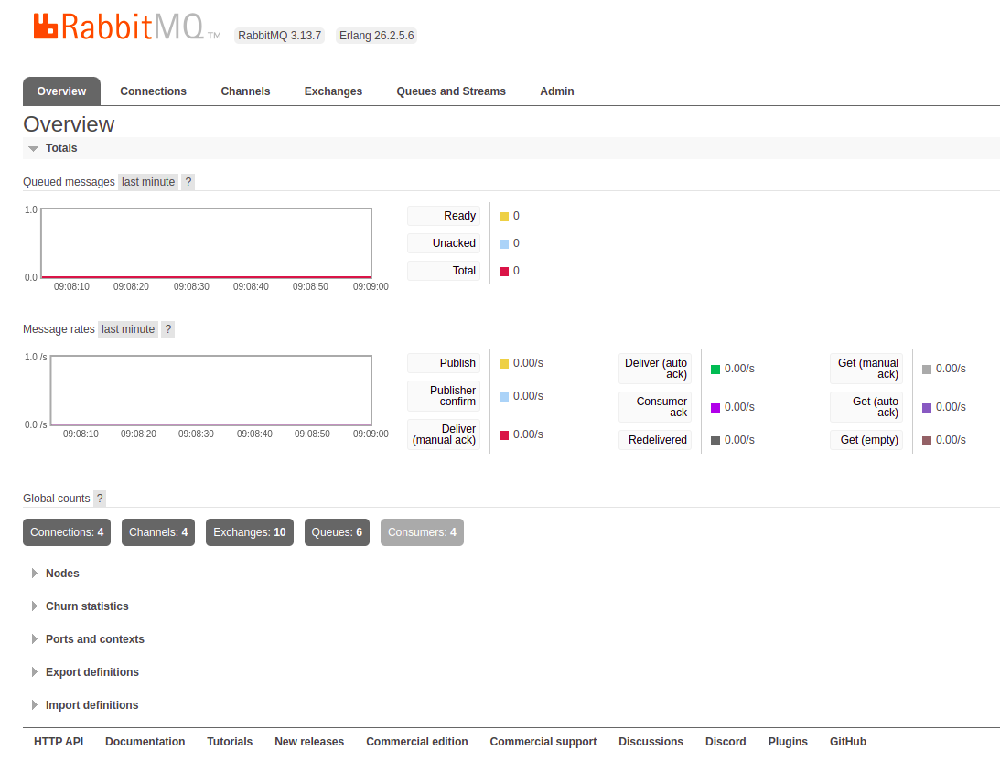
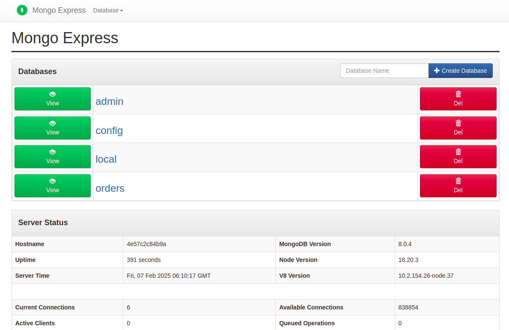
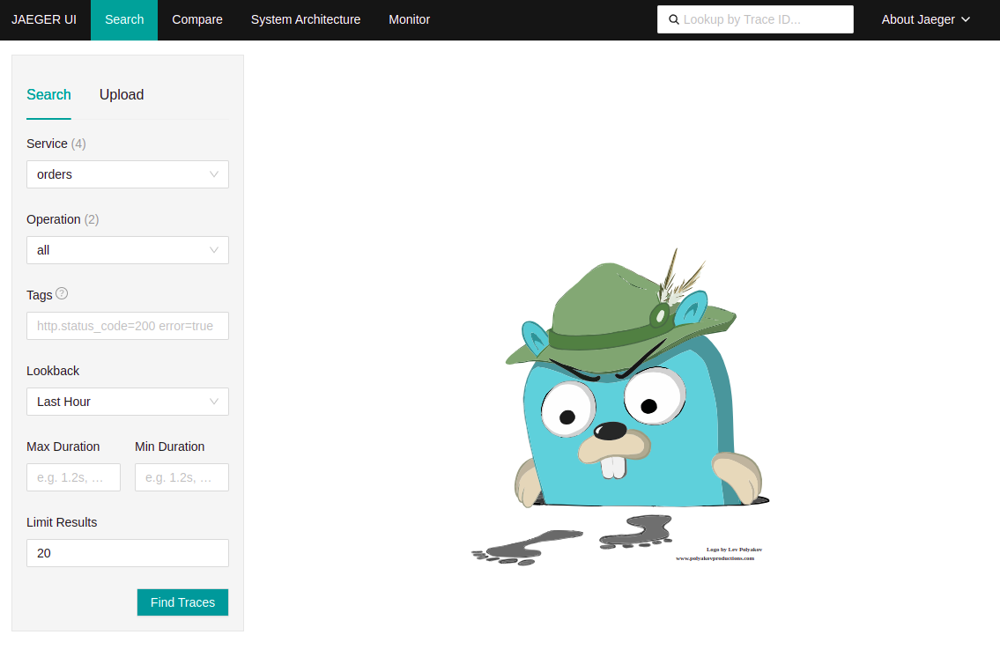

# Microservice in Go

This project is a learning exercise focused on the fundamentals of microservice architecture using Golang. It also explores essential technologies commonly used in microservice-based systems, such as service discovery, message brokers, telemetry, and gRPC for service-to-service communication.

The project is not 100% complete, but it covers the key concepts I aimed to learn. Below is an overview of the project architecture:

## Architecture Overview

## Project Overview (Video)

## Technologies Used

Here are the key technologies integrated into this project:

### **1. Consul (Service Discovery & Registration)**

### **2. Stripe (Payment Processor)**

### **3. RabbitMQ (Message Broker)**

### **4. MongoDB (Database)**

### **5. Jaeger (Telemetry & Tracing)**

### **6. Docker & Docker Compose (Containerization)**

### **7. gRPC (Service-to-Service Communication)**

### **8. Zap (Structured Logging)**

## Credits

While I made some modifications along the way, this project is largely based on a course by [Tiago](https://github.com/sikozonpc).
