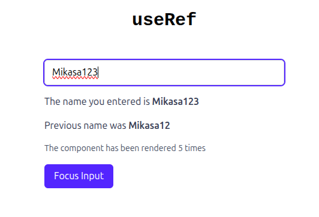

# useRef 



React's `useRef` hook gives you a way to persist a mutable value across renders, but unlike `useState`, updating a ref **does not trigger a re-render**. This makes `useRef` ideal for scenarios where you need to keep track of data or DOM nodes that shouldn't cause your component to render again when they change.

### 1. Avoid Infinite Loops from State Dependencies

If you used state to manage a value that updates in a `useEffect` (like a render count), each update would cause the effect to run again—leading to an infinite loop. With `useRef`, you can mutate `.current` without worrying about re-renders or dependency traps. That's why in [@App.tsx](./src/App.tsx) the render count is tracked with a ref, not with useState.

```js
const renderCount = useRef(1);

useEffect(() => {
  renderCount.current += 1;
}, [name]);
```

### 2. Access & Manage DOM Elements

`useRef` is also commonly used to reference DOM nodes directly (like focusing an input), since updating a ref doesn't trigger a re-render. You can attach the `ref` to a JSX element and then interact with it:

```js
const inputRef = useRef(null);

// Attach to JSX:
<input ref={inputRef} ... />

// Later, focus from code:
inputRef.current && inputRef.current.focus();
```

### 3. Storing Previous Values

Because updating a ref doesn't trigger a re-render, you can use it to keep track of previous state values outside of the render cycle:

```js
const prevName = useRef("");

useEffect(() => {
  prevName.current = name;
}, [name]);
```
Or, as in [@App.tsx](./src/App.tsx), you can update the ref with the previous state value just before the state changes, to display the previous and current name side by side.

In short: useRef is a flexible hook for storing mutable data that you don't want causing re-renders, and for referencing DOM elements directly.