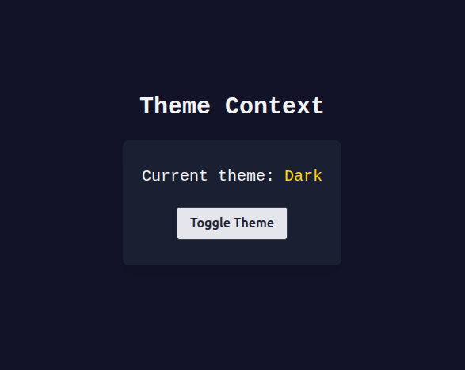

# useContext



React's `useContext` hook lets you share values or state (like theme, user, settings, etc.) across parts of your component tree without passing props manually at every level. Here are some important patterns and recommendations:

### 1. Separate Contexts for State and Updater

A common best practice is to split your context into two:

- One context for the value itself, for example the current theme (`ThemeContext`)
- Another for the updater function (like a toggle or setter, e.g. `UpdateThemeContext`)

This split (Context + Updater) pattern helps avoid unnecessary re-renders in components that only read the value or only need to update it.

#### Example

```tsx
import { createContext, useContext, useState } from "react";

const ThemeContext = createContext<boolean>(true);
const UpdateThemeContext = createContext<() => void>(() => {});

export function useTheme() {
  return useContext(ThemeContext);
}

export function useUpdateTheme() {
  return useContext(UpdateThemeContext);
}

export function ThemeProvider({ children }) {
  const [darkTheme, setDarkTheme] = useState(true);

  const toggleTheme = () => setDarkTheme(prev => !prev);

  return (
    <ThemeContext.Provider value={darkTheme}>
      <UpdateThemeContext.Provider value={toggleTheme}>
        {children}
      </UpdateThemeContext.Provider>
    </ThemeContext.Provider>
  );
}
```

### 2. Why Use Custom Hooks?

Creating custom hooks like `useTheme()` and `useUpdateTheme()` makes consuming context easier and helps avoid mistakes. Instead of importing both `useContext` and the context object everywhere, you can just use the custom hook.

```tsx
// Instead of this everywhere:
import {useContext} from "react";
import {ThemeContext} from "./ThemeContext.tsx"
const darkTheme = useContext(ThemeContext);

// You just do:
const darkTheme = useTheme();
```

### 3. Context Providers and Performance

Placing your provider close to the root of your tree makes the context value available to all nested components. The value you pass to `.Provider` (for example, `darkTheme` or your toggle function) should be stable where possible to avoid unnecessary re-renders.

Using the two-context split is a great step toward this, since only the context whose value changes will cause consumers to re-render.

---

**Summary:**  
- Use `useContext` to share state deeply across your app.
- Consider splitting value and updater into two contexts for performance.
- Use custom hooks to keep code clean and robust.
- Always use a provider above any components that consume your context.