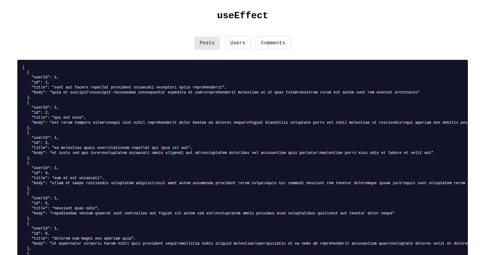

# useEffect



React's `useEffect` hook lets you run side effects in your functional components, such as fetching data or working with event listeners.

### Basic Example

Here’s a simple example that fetches data when a value changes. From the code:

```js
useEffect(() => {
  fetch(`https://jsonplaceholder.typicode.com/${resourceType}`)
    .then(response => response.json())
    .then(json => setApiResponse(json));
}, [resourceType]);
```
This runs every time `resourceType` changes and updates state with the new API data.

### Cleaning Up with Return

Sometimes side effects need to be cleaned up, such as removing event listeners or canceling timers. The function you return from `useEffect` runs when the component unmounts or just before the effect runs again.

For example, to add and remove a window resize event listener:

```js
useEffect(() => {
  function handleResize() {
    console.log('Window resized:', window.innerWidth);
  }
  window.addEventListener('resize', handleResize);

  // Cleanup: remove the event listener on unmount
  return () => {
    window.removeEventListener('resize', handleResize);
  };
}, []);
```
Here, the listener is added once when the component mounts, and removed automatically when it unmounts. This prevents memory leaks or unwanted behavior.

Use cleanup functions in `useEffect` whenever your effect should be undone to keep your components healthy and bug-free!