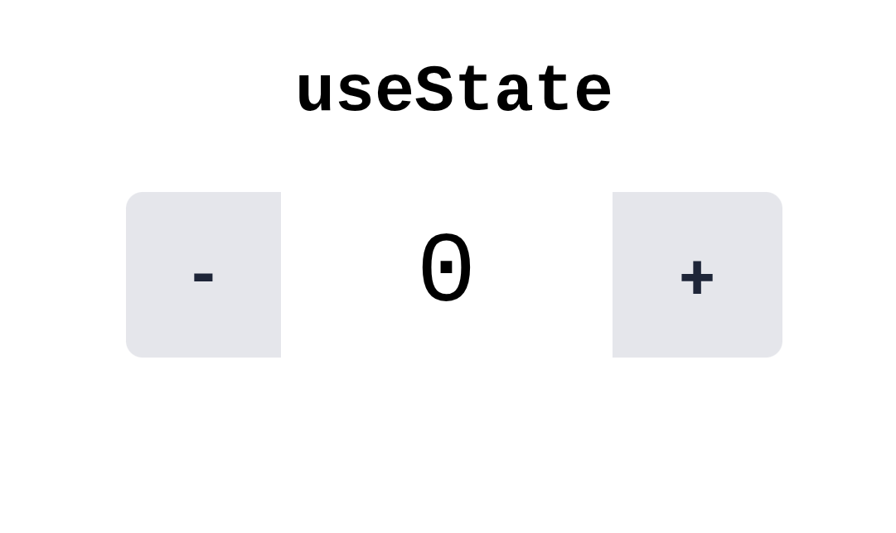

# useState 



React's `useState` hook lets you add state to your functional components. Here are some important patterns and recommendations:

### 1. Updating State Based on Previous State

When updating state that depends on its previous value, use the "functional" form of the setter. For example, instead of:

```js
setCount(count + 1);
```

Use:

```js
setCount(prevCount => prevCount + 1);
```

This ensures you always receive the latest value of state, especially if updates are batched or happen asynchronously.

### 2. Lazy Initialization for Expensive Operations

If you provide a function to `useState`, that function will run only once during initial render to calculate the state. This is useful if initializing your state is expensive:

```js
const [bigData, setBigData] = useState(() => heavyCalculation());
```

This prevents `heavyCalculation()` from running on every render; it's called only once.

### 3. Partially Updating Objects with ...prevState

If your state is an object and you need to update just one property, use the spread operator to preserve the rest:

```js
const [form, setForm] = useState({ name: '', email: '' });

setForm(prevForm => ({
  ...prevForm,
  name: 'Alice'
}));
```

This way, you only update the `name` field and leave the other fields (like `email`) unchanged.