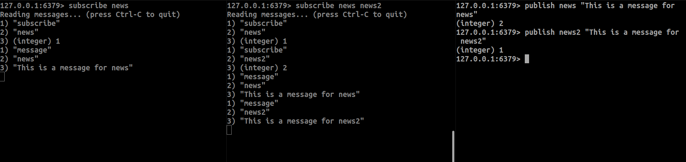
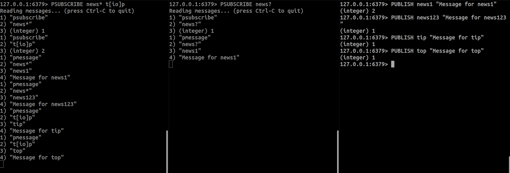

Redis can also act as a message broker with publishers and consumers. Here are some examples:

This shows how you can spin up 2 consumers where one listens to the `news` channel and the other listens to both the `news` and `other_news` channels. When a message is published to both channels from another client, you can see how they act:

You can also implement pattern-based consumers:

Here is how you can use wildcards in pattern-based channels:
* `*`: Matches zero or more characters in a channel name
  * example: `news.*` matches `news.sports`, `news.tech`, `news.weather`
* `?`: Matches exactly one character
  * example: `news.?` matches `news.a`, `news.b` but not `news.ab`
* `[...]`: Matches one character from a set
  * example: `news.[abc]` matches `news.a`, `news.b`, `news.c`

Finally, Redis PubSub offers several additional capabilities through the `PUBSUB` command:
* List all active channels using `PUBSUB CHANNELS`
* View pattern-matched channels with `PUBSUB NUMPAT`
* Check number of subscribers for specific channels with `PUBSUB NUMSUB`
* Monitor pub/sub statistics with `PUBSUB SHARDCHANNELS` and `PUBSUB SHARDNUMSUB`
* Temporarily pause channel subscriptions with `PUBSUB RESET`